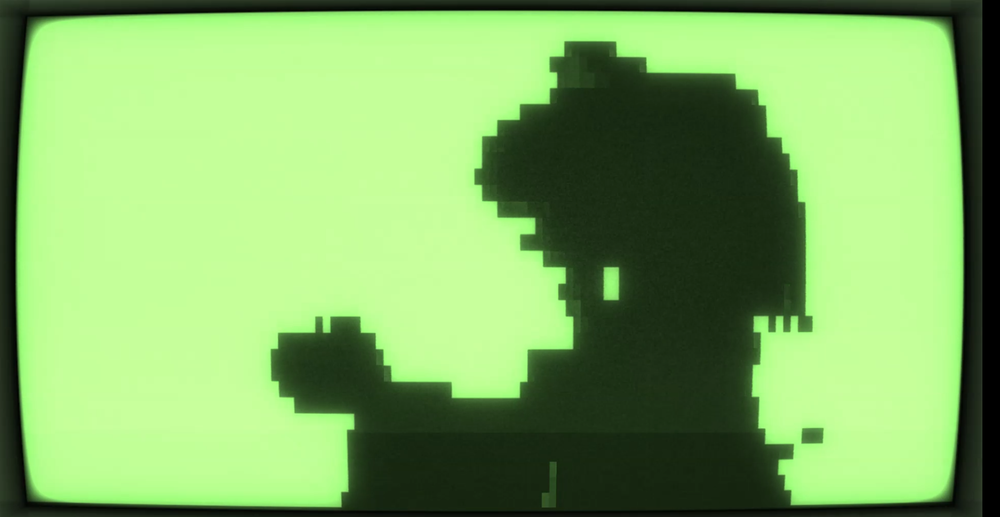

Terminal used in the screenshot: [Cool Retro Term](https://github.com/Swordfish90/cool-retro-term)
# Bad-Cli
Another command line Bad Apple player
# Installation (Linux)
```console
sudo apt install python3 git && \
pip install opencv-python ffpyplayer && \
git clone https://github.com/Ibrahimbag/bad-cli.git && \
cd bad-cli && \
python3 bad-cli.py
```
